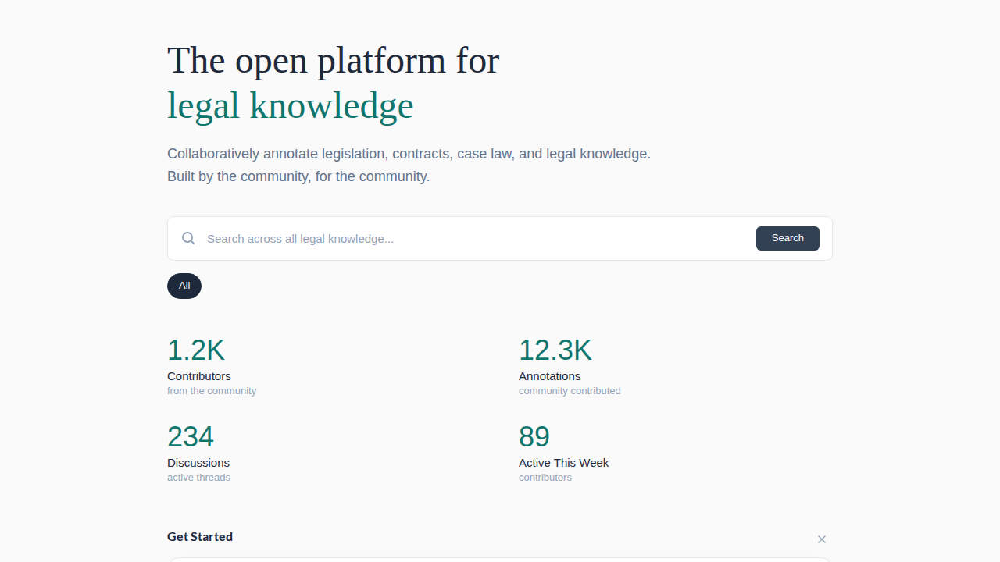
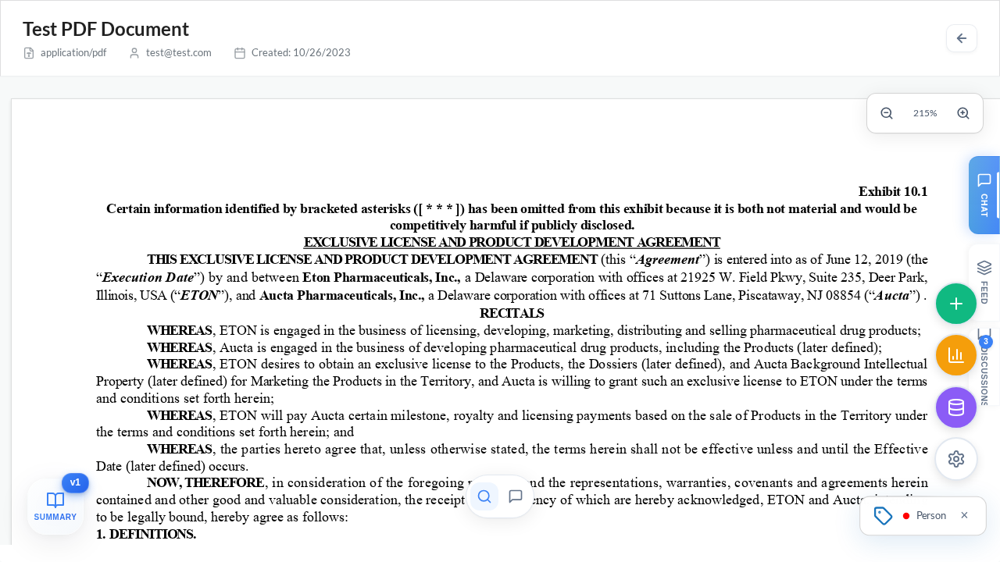
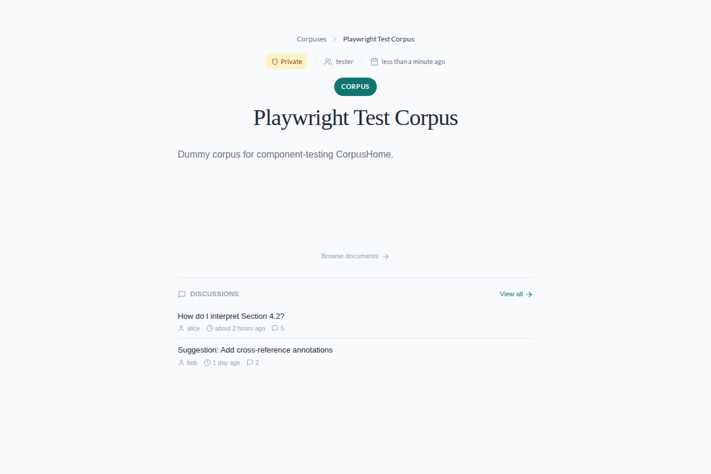
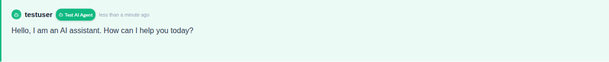
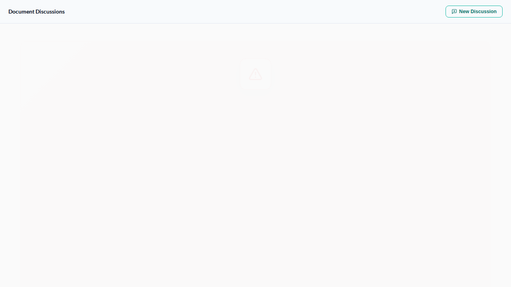
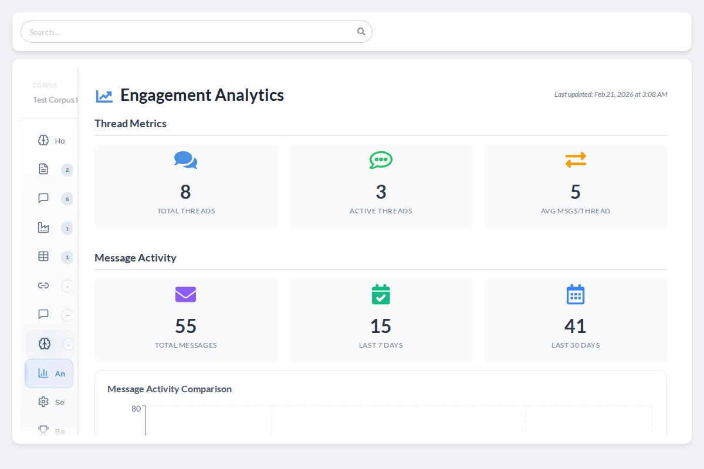

# OpenContracts ([Demo](https://contracts.opensource.legal))

The open source platform for building knowledge bases that humans and AI agents can work with together.

[](https://github.com/sponsors/JSv4)

| | |
|---|---|
| Backend CI/CD | [](https://app.codecov.io/gh/open-source-legal/OpenContracts) |
| Meta | [](https://github.com/psf/black) [](https://github.com/python/mypy) [](https://github.com/pycqa/isort) [](https://www.gnu.org/licenses/agpl-3.0) |

---



Most knowledge lives in documents. Contracts, regulations, research papers, policies — the stuff that governs how organizations actually work. That knowledge is usually trapped: locked in PDFs, scattered across drives, understood fully by a handful of people who happened to read the right things at the right time.

OpenContracts exists to fix that. It's a self-hosted platform where teams build structured, annotated, version-controlled knowledge bases from their documents — and where AI agents can work alongside humans to search, analyze, and reason over that knowledge.

The result is something that didn't exist before: a place where careful human expertise and raw AI capability meet on equal footing, with everything versioned, permissioned, and owned by you.

---

## What Makes This Different

### Human Knowledge as the Foundation

This is not another "chat with your PDFs" tool. OpenContracts treats human annotation as the ground truth. Teams define custom label schemas, annotate documents with precise selections (including multi-page spans), and map relationships between concepts. AI builds on top of that work — it doesn't replace it.



### Knowledge Bases, Not File Cabinets

Documents are organized into corpuses — version-controlled collections with folder hierarchies, fine-grained permissions, and full history. Fork a public corpus to build on someone else's annotations. Restore any previous version. Every change is tracked.

This is `git` for knowledge: you can branch, build, share, and never lose work.



### AI Agents That Work With What You've Built

Configurable AI agents can search your documents, query your annotations, and participate in discussions — all grounded in the structured knowledge your team has created. They don't hallucinate in a vacuum; they reason over real, curated data.

@mention an agent in a discussion thread. Ask it to compare clauses across a hundred contracts. Let it surface patterns your team annotated last quarter. The agent's power comes from the quality of the knowledge base underneath it.



### Collaboration Where the Knowledge Lives

Forum-style threaded discussions at every level — global, per-corpus, per-document. @mention documents, corpuses, and AI agents. Upvote the best analysis. Pin critical findings. The conversation happens next to the source material, not in a separate tool.



### Shared Knowledge Compounds

Make a corpus public. Others fork it, refine the annotations, add documents, and share their improvements. Leaderboards and badges recognize contributors. Analytics show which knowledge bases are gaining traction and where the community is most active.

This is the DRY principle applied to institutional knowledge: annotate once, build on it forever.



---

## See it in Action

### PDF Annotation Flow


### Text Format Support


---

## Quick Start

### Development

```bash
git clone https://github.com/JSv4/OpenContracts.git
cd OpenContracts
docker compose -f local.yml up
```

### Production

```bash
# Apply database migrations first
docker compose -f production.yml --profile migrate up migrate

# Start services
docker compose -f production.yml up -d
```

---

## Documentation

Browse the full documentation at [jsv4.github.io/OpenContracts](https://jsv4.github.io/OpenContracts/) or in the repo:

| Guide | Description |
|-------|-------------|
| [Quick Start](docs/quick_start.md) | Get running with Docker in minutes |
| [Key Concepts](docs/walkthrough/key-concepts.md) | Core workflows and terminology |
| [PDF Data Format](docs/architecture/PDF-data-layer.md) | How text maps to PDF coordinates |
| [LLM Framework](docs/architecture/llms/README.md) | PydanticAI integration and agents |
| [Vector Stores](docs/extract_and_retrieval/vector_stores.md) | Semantic search architecture |
| [Pipeline Overview](docs/pipelines/pipeline_overview.md) | Parser and embedder system |
| [Custom Extractors](docs/walkthrough/advanced/write-your-own-extractors.md) | Build your own data extraction tasks |
| [v3.0.0.b3 Release Notes](docs/releases/v3.0.0.b3.md) | Latest features and migration guide |

---

<details>
<summary><strong>Architecture</strong></summary>

### Data Format

OpenContracts uses a standardized format for representing text and layout on PDF pages, enabling portable annotations across tools:


### Processing Pipeline

The modular pipeline supports custom parsers, embedders, and thumbnail generators:


Each component inherits from a base class with a defined interface:
- **Parsers** — Extract text and structure from documents
- **Embedders** — Generate vector embeddings for search
- **Thumbnailers** — Create document previews

See the [pipeline documentation](docs/pipelines/pipeline_overview.md) for details on creating custom components.

</details>

---

## Telemetry

OpenContracts collects anonymous usage data to guide development priorities: installation events, feature usage statistics, and aggregate counts. We do not collect document contents, extracted data, user identities, or query contents.

**Disable backend telemetry**: Set `TELEMETRY_ENABLED=False` in your Django settings.
**Disable frontend analytics**: Leave `REACT_APP_POSTHOG_API_KEY` unset in `frontend/public/env-config.js`.

---

## Supported Formats

- PDF (full layout and annotation support)
- Text-based formats (plaintext, Markdown)

**Coming soon:** DOCX viewing and annotation powered by [Docxodus](https://github.com/JSv4/Docxodus).

---

## Acknowledgements

This project builds on work from:
- [AllenAI PAWLS](https://github.com/allenai/pawls) — PDF annotation data format and concepts
- [NLMatics nlm-ingestor](https://github.com/nlmatics/nlm-ingestor) — Document parsing pipeline

---

## License

AGPL-3.0 — See [LICENSE](LICENSE) for details.
