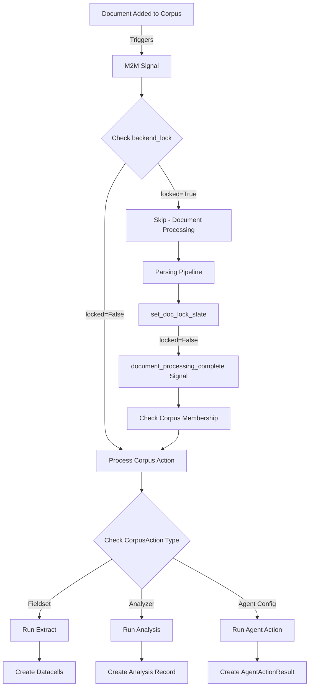

# CorpusAction System in OpenContracts

The CorpusAction system in OpenContracts automates document processing when documents are added to or edited in a corpus. This system is designed to be flexible, allowing for different types of actions to be triggered based on configuration.

## Action Types

Users have three options for registering actions to run automatically on documents:

1. **Fieldset-based Extractions** - Run data extraction using configured fieldsets and columns
2. **Analyzer-based Analyses** - Execute analyses using task-based or Gremlin-hosted analyzers
3. **Agent-based Actions** - Invoke AI agents with pre-authorized tools for intelligent document processing

## Deferred Action Architecture

**Important**: Corpus actions only run after documents are fully processed (parsed, thumbnailed, embedded). This is achieved through an event-driven architecture:

1. When a document is **added to a corpus** (M2M signal):
   - If document is **ready** (`backend_lock=False`): trigger actions immediately
   - If document is **processing** (`backend_lock=True`): skip it (handled later)

2. When document **processing completes** (`document_processing_complete` signal):
   - Check all corpuses the document belongs to
   - Trigger ADD_DOCUMENT actions for each corpus

This ensures agent tools like `load_document_text` have access to fully parsed content.

## Action Execution Overview

The following flowchart illustrates the complete CorpusAction system:



## Key Components

1. **CorpusAction Model**: Defines the action to be taken, including:
   - Reference to the associated corpus
   - Trigger type (ADD_DOCUMENT, EDIT_DOCUMENT)
   - Reference to ONE of: Fieldset, Analyzer, or AgentConfiguration
   - Optional: `agent_prompt` and `pre_authorized_tools` for agent actions

2. **CorpusActionTrigger Enum**: Defines trigger events
   - `ADD_DOCUMENT` - Fires when documents are added
   - `EDIT_DOCUMENT` - Fires when documents are edited

3. **Signal Handlers** (`opencontractserver/corpuses/signals.py`):
   - `handle_document_added_to_corpus` - M2M signal, filters locked documents
   - `handle_document_processing_complete` - Triggers deferred actions

4. **Custom Signal** (`opencontractserver/documents/signals.py`):
   - `document_processing_complete` - Fired when document parsing finishes

5. **Celery Tasks**: Perform the actual processing asynchronously

## Process Flow

### 1. Document Addition with Deferred Actions

When a document is added to a corpus, the M2M signal fires:

```python
@receiver(m2m_changed, sender=Corpus.documents.through)
def handle_document_added_to_corpus(sender, instance, action, pk_set, **kwargs):
    if action != "post_add" or not pk_set:
        return

    # Filter to only documents that are ready (not still processing)
    ready_doc_ids = list(
        Document.objects.filter(
            id__in=pk_set,
            backend_lock=False,  # Only ready documents
        ).values_list("id", flat=True)
    )

    # Only trigger actions for ready documents
    # Locked documents will be handled by document_processing_complete signal
    if ready_doc_ids:
        process_corpus_action.si(
            corpus_id=instance.id,
            document_ids=ready_doc_ids,
            user_id=instance.creator.id,
            trigger=CorpusActionTrigger.ADD_DOCUMENT,
        ).apply_async()
```

### 2. Processing Complete Signal

When document parsing finishes, deferred actions are triggered:

```python
@receiver(document_processing_complete)
def handle_document_processing_complete(sender, document, user_id, **kwargs):
    # Get all corpuses this document belongs to
    corpuses = Corpus.objects.filter(documents=document)

    for corpus in corpuses:
        process_corpus_action.si(
            corpus_id=corpus.id,
            document_ids=[document.id],
            user_id=corpus.creator.id,
            trigger=CorpusActionTrigger.ADD_DOCUMENT,
        ).apply_async()
```

### 3. Action Processing

The `process_corpus_action` task determines the appropriate action based on configuration:

```python
@shared_task
def process_corpus_action(
    corpus_id: str | int,
    document_ids: list[str | int],
    user_id: str | int,
    trigger: str | None = None,
):
    # Build query for matching actions
    base_query = Q(corpus_id=corpus_id, disabled=False) | Q(
        run_on_all_corpuses=True, disabled=False
    )
    if trigger:
        base_query &= Q(trigger=trigger)

    actions = CorpusAction.objects.filter(base_query)

    for action in actions:
        if action.fieldset:
            # Path A: Run Extract with Fieldset
            extract, created = Extract.objects.get_or_create(
                corpus=action.corpus,
                fieldset=action.fieldset,
                creator_id=user_id,
                corpus_action=action,
            )
            # Create datacells and queue extraction tasks...

        elif action.analyzer:
            # Path B: Run Analysis
            if action.analyzer.task_name:
                # Task-based analyzer (decorated with @doc_analyzer_task)
                run_task_name_analyzer.si(analysis_id=analysis.id, ...).apply_async()
            else:
                # Gremlin-hosted analyzer
                start_analysis.s(analysis_id=analysis.id, ...).apply_async()

        elif action.agent_config:
            # Path C: Run Agent Action
            for document_id in document_ids:
                run_agent_corpus_action.delay(
                    corpus_action_id=action.id,
                    document_id=document_id,
                    user_id=user_id,
                )
```

## Behavior Matrix

| Scenario | M2M Signal | Processing Complete Signal |
|----------|------------|---------------------------|
| New doc uploaded to corpus | Skipped (locked) | Triggers actions |
| Existing processed doc added | Triggers immediately | N/A (already unlocked) |
| Doc in multiple corpuses | N/A | Triggers for ALL corpuses |
| Doc not in any corpus | N/A | No action |

## Creating Corpus Actions

### Via GraphQL

```graphql
# Fieldset-based action
mutation {
  create_corpus_action(
    corpusId: "Q29ycHVzVHlwZTox"
    trigger: "add_document"
    name: "Extract Contract Data"
    fieldsetId: "RmllbGRzZXRUeXBlOjE="
  ) {
    ok
    obj { id name }
  }
}

# Analyzer-based action
mutation {
  create_corpus_action(
    corpusId: "Q29ycHVzVHlwZTox"
    trigger: "add_document"
    name: "Classify Documents"
    analyzerId: "QW5hbHl6ZXJUeXBlOjE="
  ) {
    ok
    obj { id name }
  }
}

# Agent-based action
mutation {
  create_corpus_action(
    corpusId: "Q29ycHVzVHlwZTox"
    trigger: "add_document"
    name: "Auto-Generate Summary"
    agentConfigId: "QWdlbnRDb25maWd1cmF0aW9uVHlwZTox"
    agentPrompt: "Analyze this document and create a summary using update_document_summary tool."
    preAuthorizedTools: ["load_document_text", "update_document_summary"]
  ) {
    ok
    obj { id name agentPrompt }
  }
}
```

## Related Documentation

- [Using Corpus Actions (User Guide)](../corpus_actions/intro_to_corpus_actions.md)
- [Agent-Based Corpus Actions Design](./agent_corpus_actions_design.md)
- [Pipeline Overview](../pipelines/pipeline_overview.md)
- [LLM Framework](./llms/README.md)
