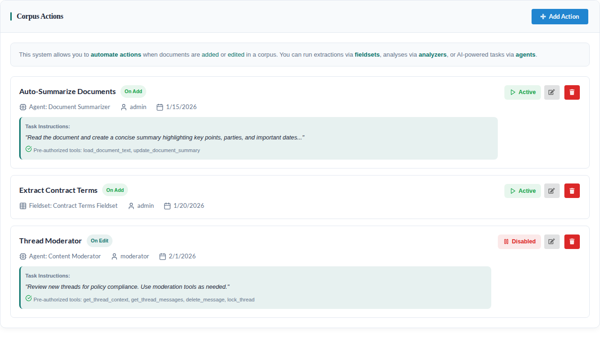
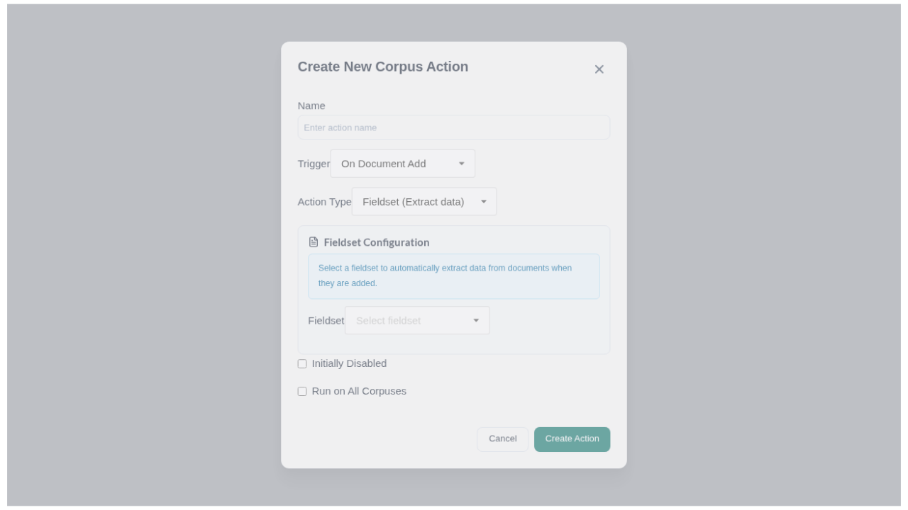
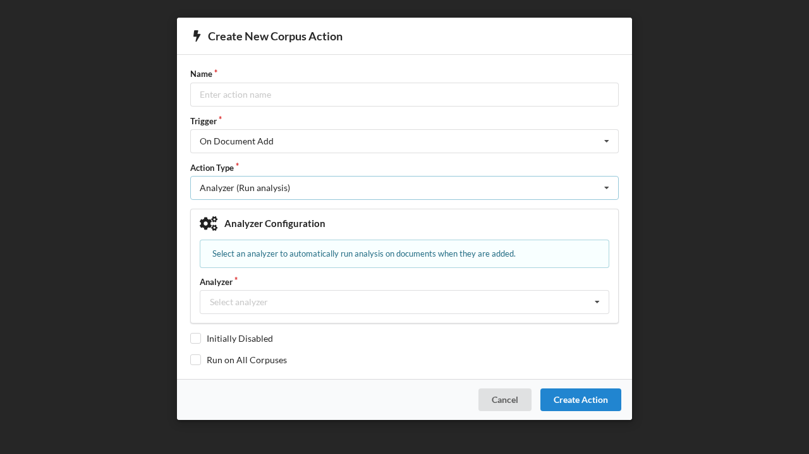
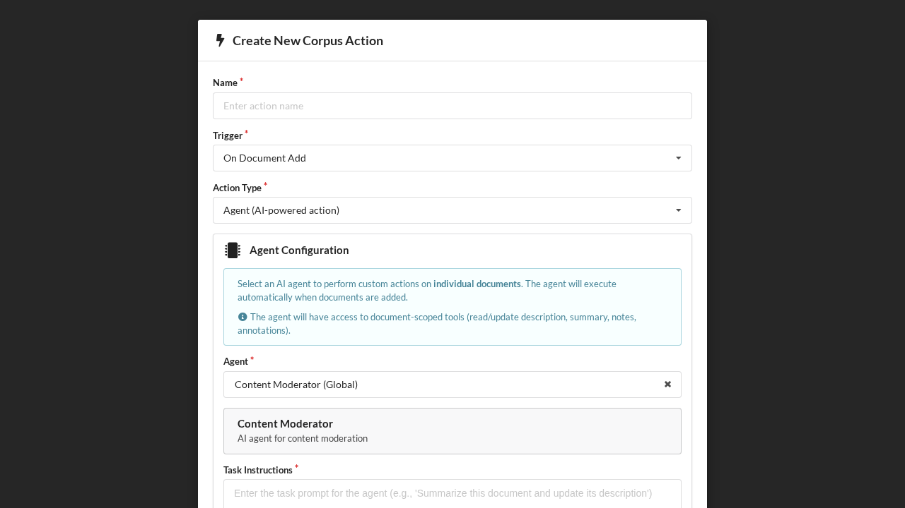
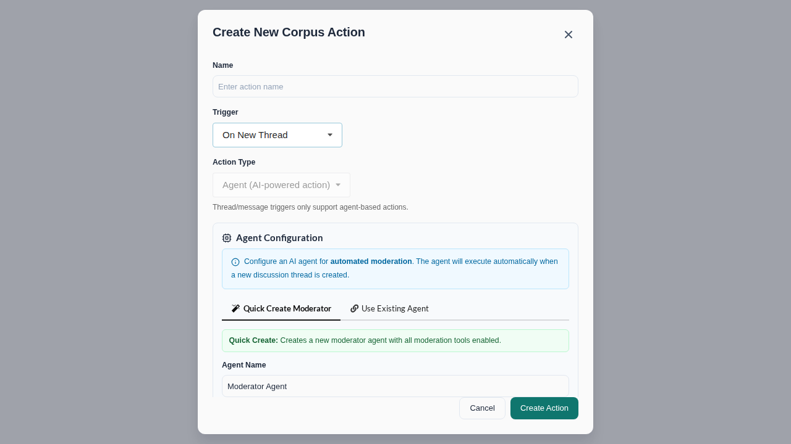
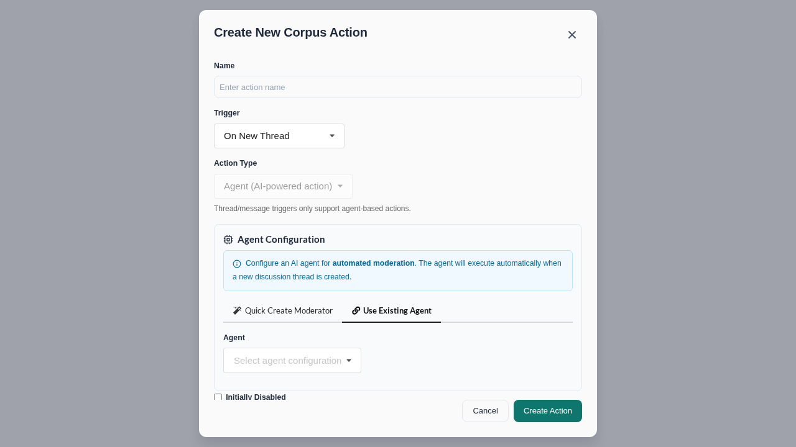

# Using Corpus Actions

Corpus Actions automate processing when specific events occur in a corpus. You can configure three types of actions:

1. **Fieldset-based Extractions** - Extract structured data using fieldsets
2. **Analyzer-based Analyses** - Run classification or annotation analyzers
3. **Agent-based Actions** - Invoke AI agents with pre-authorized tools

## Trigger Types

| Trigger | Event | Supported Actions |
|---------|-------|-------------------|
| `add_document` | Document added to corpus | Fieldset, Analyzer, Agent |
| `edit_document` | Document edited in corpus | Fieldset, Analyzer, Agent |
| `new_thread` | Discussion thread created | Agent only |
| `new_message` | Message posted to thread | Agent only |

> **Note**: Thread and message triggers are designed for AI-powered moderation workflows. See the [walkthrough guide](../walkthrough/step-9-corpus-actions.md) for detailed examples.

## Important: Deferred Execution

Corpus actions automatically wait for documents to be fully processed (parsed, thumbnailed) before executing. This ensures that agent tools like `load_document_text` have access to complete document content.

- **New uploads**: Actions trigger after parsing completes
- **Existing documents**: Actions trigger immediately when added to corpus

## Via the GUI

For Corpuses you *own*, you can go to the Corpus settings tab and view configured actions or configure new actions.

### Action List View

The settings tab shows all configured actions with their type, trigger, status, and task instructions:



### Creating a New Action

Click **Add Action** to open the creation modal. The default view shows fieldset configuration:



Switch to **Analyzer** for classification actions:



Switch to **Agent** for AI-powered actions with pre-authorized tools:



### Thread Moderation Actions

For thread/message triggers, a quick-create moderator mode is available with pre-selected moderation tools:



Or select an existing agent configuration:



## Via API

### 1. Querying Document Actions

Query available actions for a document in a corpus using the `document_corpus_actions` query:

```graphql
query GetDocumentActions($documentId: ID!, $corpusId: ID!) {
  document_corpus_actions(documentId: $documentId, corpusId: $corpusId) {
    corpus_actions {
      id
      name
      trigger
      disabled
      run_on_all_corpuses
      fieldset {
        id
        name
      }
      analyzer {
        id
        description
      }
      agent_config {
        id
        name
        system_instructions
      }
      task_instructions
      pre_authorized_tools
    }
    extracts {
      id
      name
    }
    analysis_rows {
      id
    }
    agent_results {
      id
      status
      agent_response
    }
  }
}
```

### 2. Creating Corpus Actions

Use the `create_corpus_action` mutation to create a new action. You must specify exactly ONE of: `fieldsetId`, `analyzerId`, or `agentConfigId`.

#### Fieldset-based Action

Run data extraction when documents are added:

```graphql
mutation CreateFieldsetAction {
  create_corpus_action(
    corpusId: "Q29ycHVzVHlwZTox"
    trigger: "add_document"
    name: "Extract Contract Data"
    fieldsetId: "RmllbGRzZXRUeXBlOjE="
    disabled: false
  ) {
    ok
    message
    obj {
      id
      name
      trigger
    }
  }
}
```

#### Analyzer-based Action

Run analysis when documents are edited:

```graphql
mutation CreateAnalyzerAction {
  create_corpus_action(
    corpusId: "Q29ycHVzVHlwZTox"
    trigger: "edit_document"
    name: "Classify Document Type"
    analyzerId: "QW5hbHl6ZXJUeXBlOjE="
    disabled: false
  ) {
    ok
    message
    obj {
      id
      name
      trigger
    }
  }
}
```

#### Agent-based Action

Invoke an AI agent with pre-authorized tools:

```graphql
mutation CreateAgentAction {
  create_corpus_action(
    corpusId: "Q29ycHVzVHlwZTox"
    trigger: "add_document"
    name: "Auto-Generate Summary"
    agentConfigId: "QWdlbnRDb25maWd1cmF0aW9uVHlwZTox"
    taskInstructions: """
      Analyze this document and create a comprehensive summary.

      1. Use load_document_text to read the full content
      2. Identify the document type, key parties, and main topics
      3. Use update_document_summary to save a 3-5 sentence summary

      Focus on: document purpose, key terms, important dates, and parties involved.
    """
    preAuthorizedTools: ["load_document_text", "load_document_summary", "update_document_summary"]
    disabled: false
  ) {
    ok
    message
    obj {
      id
      name
      task_instructions
      pre_authorized_tools
    }
  }
}
```

### Input Parameters

| Parameter | Required | Description |
|-----------|----------|-------------|
| `corpusId` | Yes | The corpus to attach the action to |
| `trigger` | Yes | One of: `"add_document"`, `"edit_document"`, `"new_thread"`, `"new_message"` |
| `name` | No | Custom name (defaults to "Corpus Action") |
| `fieldsetId` | One of three | Fieldset for data extraction (document triggers only) |
| `analyzerId` | One of three | Analyzer for classification/annotation (document triggers only) |
| `agentConfigId` | One of three | Agent configuration for AI processing |
| `taskInstructions` | No | Task-specific prompt for agent actions |
| `preAuthorizedTools` | No | Tools pre-approved for automated execution |
| `disabled` | No | Whether action is initially disabled |
| `runOnAllCorpuses` | No | Run on all corpuses (admin only) |

> **Note**: Thread/message triggers (`new_thread`, `new_message`) only support agent-based actions.

### Permissions

- User must have **UPDATE** permission on the corpus
- User must have **READ** permission on the fieldset (if using fieldset)
- User must have **READ** permission on the agent configuration (if using agent)

### Error Handling

The mutation returns:
- `ok`: Boolean indicating success
- `message`: Description of the result or error
- `obj`: The created CorpusAction if successful, null if failed

Common error cases:

```graphql
# Missing permission
{
  "ok": false,
  "message": "You don't have permission to create actions for this corpus",
  "obj": null
}

# Invalid action type configuration
{
  "ok": false,
  "message": "Exactly one of fieldset_id, analyzer_id, or agent_config_id must be provided",
  "obj": null
}

# Missing fieldset permission
{
  "ok": false,
  "message": "You don't have permission to use this fieldset",
  "obj": null
}

# Missing agent config permission
{
  "ok": false,
  "message": "You don't have permission to use this agent configuration",
  "obj": null
}
```

### 3. Querying Agent Action Results

For agent-based actions, you can query execution results:

```graphql
query GetAgentResults($corpusActionId: ID!) {
  agent_action_results(corpusActionId: $corpusActionId) {
    edges {
      node {
        id
        document {
          id
          title
        }
        status
        agent_response
        tools_executed
        started_at
        completed_at
        error_message
      }
    }
  }
}
```

Result statuses:
- `PENDING` - Queued for execution
- `RUNNING` - Currently executing
- `COMPLETED` - Successfully finished
- `FAILED` - Execution failed (see `error_message`)

## Common Use Cases

### Auto-Summarization

```graphql
mutation {
  create_corpus_action(
    corpusId: "..."
    trigger: "add_document"
    name: "Auto-Summarize"
    agentConfigId: "..."
    taskInstructions: "Read this document and create a concise summary highlighting key points."
    preAuthorizedTools: ["load_document_text", "update_document_summary"]
  ) { ok }
}
```

### Auto-Tagging

```graphql
mutation {
  create_corpus_action(
    corpusId: "..."
    trigger: "add_document"
    name: "Auto-Tag Documents"
    agentConfigId: "..."
    taskInstructions: "Analyze this document and add appropriate tags based on content type and subject matter."
    preAuthorizedTools: ["load_document_text", "add_document_annotation"]
  ) { ok }
}
```

### Data Extraction on Edit

```graphql
mutation {
  create_corpus_action(
    corpusId: "..."
    trigger: "edit_document"
    name: "Re-extract on Edit"
    fieldsetId: "..."
  ) { ok }
}
```

### Thread Moderation

Automatically moderate new messages in discussion threads:

```graphql
mutation {
  create_corpus_action(
    corpusId: "..."
    trigger: "new_message"
    name: "Auto-Moderate Messages"
    agentConfigId: "..."
    taskInstructions: """
      You are a thread moderator. Review the new message for policy compliance.

      1. Use get_thread_context to understand the discussion
      2. Use get_message_content to read the new message
      3. If the message violates guidelines, use delete_message
      4. If the thread is going off-topic, consider using lock_thread
      5. Optionally respond with add_thread_message if helpful
    """
    preAuthorizedTools: [
      "get_thread_context",
      "get_thread_messages",
      "get_message_content",
      "add_thread_message",
      "lock_thread",
      "unlock_thread",
      "delete_message",
      "pin_thread",
      "unpin_thread"
    ]
  ) { ok }
}
```

### Auto-Respond to New Threads

Automatically greet users when they create discussion threads:

```graphql
mutation {
  create_corpus_action(
    corpusId: "..."
    trigger: "new_thread"
    name: "Welcome New Threads"
    agentConfigId: "..."
    taskInstructions: """
      A new discussion thread has been created. Welcome the user and provide
      any relevant context about the corpus or discussion guidelines.

      Use add_thread_message to post a welcome message.
    """
    preAuthorizedTools: ["get_thread_context", "add_thread_message"]
  ) { ok }
}
```

## Related Documentation

- [CorpusAction System Architecture](../architecture/opencontract-corpus-actions.md)
- [Agent-Based Corpus Actions Design](../architecture/agent_corpus_actions_design.md)
- [LLM Framework](../architecture/llms/README.md)
