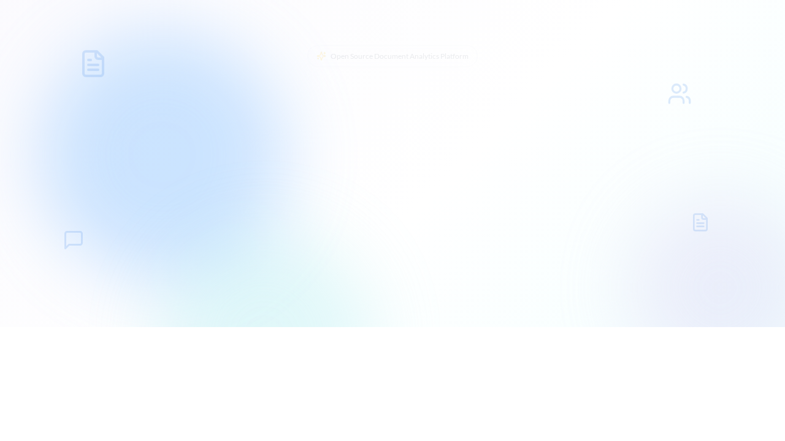

# Documentation Screenshots

OpenContracts uses **auto-generated screenshots** captured during Playwright component tests to keep documentation images in sync with the actual UI. There are two distinct lifecycles:

| | `docScreenshot` | `releaseScreenshot` |
|---|---|---|
| **Purpose** | Evergreen docs (README, guides) | Release notes (frozen at release time) |
| **Output** | `docs/assets/images/screenshots/auto/` | `docs/assets/images/screenshots/releases/{version}/` |
| **CI behavior** | Overwritten on every PR | Never touched |
| **Overwrites?** | Always | Never (write-once) |

## Utility API

Source: `frontend/tests/utils/docScreenshot.ts`

### `docScreenshot(page, name, options?)`

Captures a screenshot that CI regenerates on every PR.

```ts
import { docScreenshot } from "./utils/docScreenshot";

await docScreenshot(page, "landing--hero-section--anonymous");
await docScreenshot(page, "badges--modal--auto-award", { element: component });
await docScreenshot(page, "corpus--list-view--with-items", { fullPage: true });
```

**Naming convention** — use `--` (double-dash) to separate hierarchical segments:

```
{area}--{component}--{state}.png
```

| Segment | Purpose | Examples |
|---------|---------|----------|
| `area` | Feature area | `landing`, `badges`, `corpus`, `versioning` |
| `component` | Specific view | `hero-section`, `celebration-modal`, `list-view` |
| `state` | Visual state | `anonymous`, `with-data`, `empty` |

Rules:

- At least 2 segments required, 3 recommended
- All segments lowercase alphanumeric with single hyphens between words
- Validated at runtime — invalid names throw

### `releaseScreenshot(page, version, name, options?)`

Captures a **write-once** screenshot for release notes. If the file already exists, the call is a silent no-op.

```ts
import { releaseScreenshot } from "./utils/docScreenshot";

await releaseScreenshot(page, "v3.0.0.b3", "landing-page", { fullPage: true });
await releaseScreenshot(page, "v3.0.0.b3", "badge-celebration", { element: component });
```

- Version must match `v{major}.{minor}.{patch}` (with optional suffix like `.b3`)
- Name is simple kebab-case (no `--` segment convention)

### Shared options

Both functions accept the same options object:

| Option | Type | Description |
|--------|------|-------------|
| `element` | `Locator` | Capture only this element (tightly cropped) |
| `fullPage` | `boolean` | Capture full scrollable page |
| `clip` | `{ x, y, width, height }` | Capture a specific region |

If no options are provided, the viewport is captured.

## Referencing in Markdown

```md
<!-- Evergreen (auto) -->


<!-- Release (frozen) -->

```

## Adding a New Screenshot

1. Find or create a component test (`.ct.tsx`) that renders the desired visual state
2. Add assertions that confirm the component is in the right state
3. Call `docScreenshot` (or `releaseScreenshot`) **after** the assertions pass
4. Run the test locally: `cd frontend && yarn test:ct --reporter=list -g "test name"`
5. Verify the PNG in the output directory
6. Reference it in your markdown docs
7. Commit the test change and the PNG — CI will keep it fresh on future PRs

## CI Workflow

The `screenshots.yml` workflow (`.github/workflows/screenshots.yml`) runs on every PR that touches `frontend/` or `docs/`:

1. Checks out the PR branch
2. Runs all component tests (which capture screenshots as a side-effect)
3. If any files in `auto/` changed, commits and pushes them back to the PR branch
4. Test failures don't block screenshot commits (`continue-on-error: true`) — the main CI workflow gates on test success separately

The workflow only touches `docs/assets/images/screenshots/auto/`. Release screenshots in `releases/` are never modified by CI.

## Merge Conflict Handling

Because CI commits auto-generated PNGs to every PR branch, merge conflicts on binary screenshot files are common when multiple PRs are open simultaneously.

### How conflicts are mitigated

**`.gitattributes`** marks auto screenshots with `merge=ours`:

```
docs/assets/images/screenshots/auto/** merge=ours -diff -text
```

This tells Git: when a merge or rebase encounters a conflict on these files, silently keep the current branch's version. Since CI regenerates the correct screenshots on the next run, any "stale" version is temporary.

Note: we use `-diff -text` (not `binary`) to suppress diffs without overriding the merge strategy. The `binary` macro expands to `-diff -merge -text`, and that `-merge` would override `merge=ours`.

**CI workflow** registers the merge driver and rebases before pushing:

```yaml
git config merge.ours.driver true
git pull --rebase origin ${{ github.head_ref }}
```

If the rebase still fails (e.g. non-screenshot conflicts), it falls back to `git checkout --ours` on the auto directory.

### Local setup

The `merge=ours` strategy requires a one-time driver registration in your local Git config:

```bash
git config merge.ours.driver true
```

After this, local `git merge` and `git rebase` operations will auto-resolve screenshot conflicts.

### GitHub merge button limitation

GitHub's server-side merge (the "Merge pull request" button) does **not** use custom merge drivers from `.gitattributes`. If two PRs both have CI-committed screenshot changes and one merges first, the second PR may still show merge conflicts in the GitHub UI.

**To resolve:** click "Update branch" in the PR (or locally run `git pull --rebase origin main`). The `merge=ours` strategy resolves the screenshot conflicts, and CI will regenerate fresh screenshots on the updated branch.

This is a known GitHub limitation — server-side merges only support built-in merge strategies, not custom drivers.

## Directory Structure

```
docs/assets/images/screenshots/
├── auto/                          # CI-managed, overwritten every PR
│   ├── landing--discovery-page--anonymous.png
│   ├── badges--celebration-modal--auto-award.png
│   ├── readme--document-annotator--with-pdf.png
│   └── ...
├── releases/                      # Write-once, never overwritten
│   └── v3.0.0.b3/
│       ├── landing-page.png
│       ├── badge-celebration.png
│       └── ...
└── (manually curated images)      # Not managed by either utility
```
