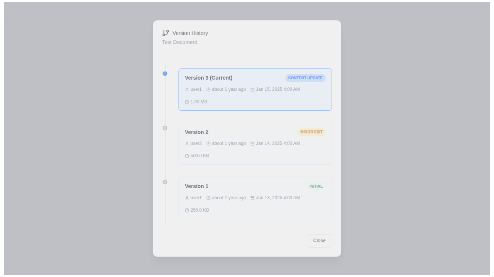
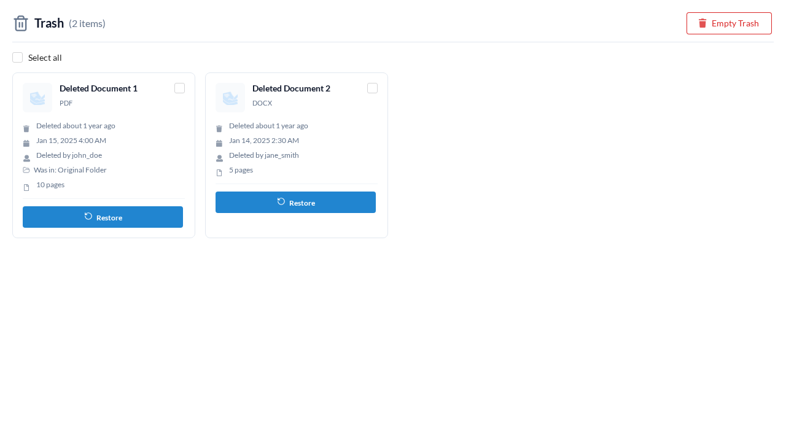

# Document Version Selector

## Overview

OpenContracts tracks every change to your documents using an immutable version
history. When you re-upload a file at the same path inside a corpus, the platform
creates a **new version** rather than overwriting the original. A small
**version badge** on each document card tells you at a glance whether the
document has history, and the **Version History Panel** lets you browse, compare,
and restore any past version.

## Version Creation

Versions are created automatically when a document is uploaded to a path that
already contains a file:

1. **First upload** &mdash; creates Version 1 (the initial version).
2. **Subsequent uploads at the same path** &mdash; each one creates a new
   version (v2, v3, &hellip;). The previous version is preserved and can be
   accessed at any time.

Moves and renames do **not** bump the version number &mdash; only content
changes do.

## Visual Status Indicators

Every document card displays a small badge in its top-right corner. The badge
color communicates the document's version state at a glance:

| Badge Color | Meaning                            | Example                   |
| ----------- | ---------------------------------- | ------------------------- |
| **Gray**    | Single version, no history         | `v1`                      |
| **Blue**    | Latest version, history available  | `v3 • 5` (version 3 of 5) |
| **Orange**  | Older version (a newer one exists) | `v2 • 3` (version 2 of 3) |

### Single-Version Badge (Gray)

Documents that have never been updated show a simple gray `v1` badge. The badge
is not clickable because there is no history to browse.

### Latest-Version Badge (Blue)

When a document has multiple versions and you are viewing the latest one, the
badge turns blue and shows the version count (e.g. `v3 • 5`). Click the badge
to open the Version History Panel.

### Older-Version Badge (Orange)

If you are viewing a version that is **not** the latest, the badge turns orange
as a warning. This helps you notice when you are looking at outdated content.
Hovering over it shows additional context.

## Version History Panel

Clicking a blue or orange version badge opens the **Version History Panel**, a
modal dialog with a vertical timeline of every version.

Each version card shows:

- **Version number** and whether it is the current version
- **Change type** badge (Initial, Content Update, Minor Edit, Major Revision)
- **Author** who created that version
- **Timestamps** (relative and absolute)
- **File size**

### Selecting a Version

Click any version card to select it. For non-current versions, two action
buttons appear:

- **Restore This Version** &mdash; creates a new version with the selected
  version's content (the old version is preserved, not overwritten).
- **Download** &mdash; downloads the file for that specific version.

Selecting the current version shows an informational message instead.

### Restore Feedback

After restoring:

- A **green success message** confirms the new version number (auto-dismisses
  after 5 seconds).
- If the restore fails, a **red error message** explains why (auto-dismisses
  after 10 seconds).

Both messages can be dismissed manually by clicking the close icon.

## Trash Folder and Document Recovery

When a document is deleted, it is **soft-deleted** &mdash; it moves to the
corpus Trash folder rather than being permanently removed.

The Trash folder view shows:

- Each deleted document with its original title, file type, page count, and
  the user who last modified it.
- The **original folder** the document belonged to (if any).
- A **Restore** button on every document card.
- **Select all** / **Clear Selection** controls for bulk operations.
- A **Restore Selected** button for restoring multiple documents at once.
- An **Empty Trash** button for permanently removing all items.

### Restoring a Deleted Document

1. Open the Trash folder from the corpus folder sidebar.
2. Click **Restore** on the document you want to recover, or select multiple
   documents and click **Restore Selected**.
3. The document reappears at its original path and folder.

Partial failures during bulk restore are handled gracefully &mdash; successfully
restored documents are removed from the trash while failed ones remain with an
error message.

## Technical Details

### Architecture

Document versioning uses a **dual-tree architecture**:

- **Content Tree** (Document model) &mdash; tracks "what is this file's
  content?" Each upload creates a new Document node linked to its predecessor.
- **Path Tree** (DocumentPath model) &mdash; tracks "where has this file
  lived?" Every lifecycle event (import, move, delete, restore) creates a new
  path node.

For the full architecture specification, see
[Dual-Tree Document Versioning Architecture](../architecture/document_versioning.md).

### Components

| Component             | Location                                                       | Purpose                                           |
| --------------------- | -------------------------------------------------------------- | ------------------------------------------------- |
| `VersionBadge`        | `frontend/src/components/documents/VersionBadge.tsx`           | Color-coded badge on document cards               |
| `VersionHistoryPanel` | `frontend/src/components/documents/VersionHistoryPanel.tsx`    | Timeline modal with restore/download actions      |
| `TrashFolderView`     | `frontend/src/components/corpuses/folders/TrashFolderView.tsx` | Trash folder with bulk restore                    |
| `ModernDocumentItem`  | `frontend/src/components/documents/ModernDocumentItem.tsx`     | Document card that integrates the badge and panel |

### GraphQL Operations

| Operation                     | Type     | Description                                           |
| ----------------------------- | -------- | ----------------------------------------------------- |
| `GetDocumentVersionHistory`   | Query    | Fetches version list with metadata for a document     |
| `RestoreDocumentToVersion`    | Mutation | Creates a new version from a previous one             |
| `GetDeletedDocumentsInCorpus` | Query    | Lists soft-deleted documents in a corpus              |
| `RestoreDeletedDocument`      | Mutation | Restores a soft-deleted document to its original path |

### Corpus Isolation

Each corpus maintains completely independent version trees. Uploading the same
file to two different corpuses creates two separate, unrelated documents. This
ensures there are no cross-corpus version conflicts and supports per-corpus
embedding models for vector search.
