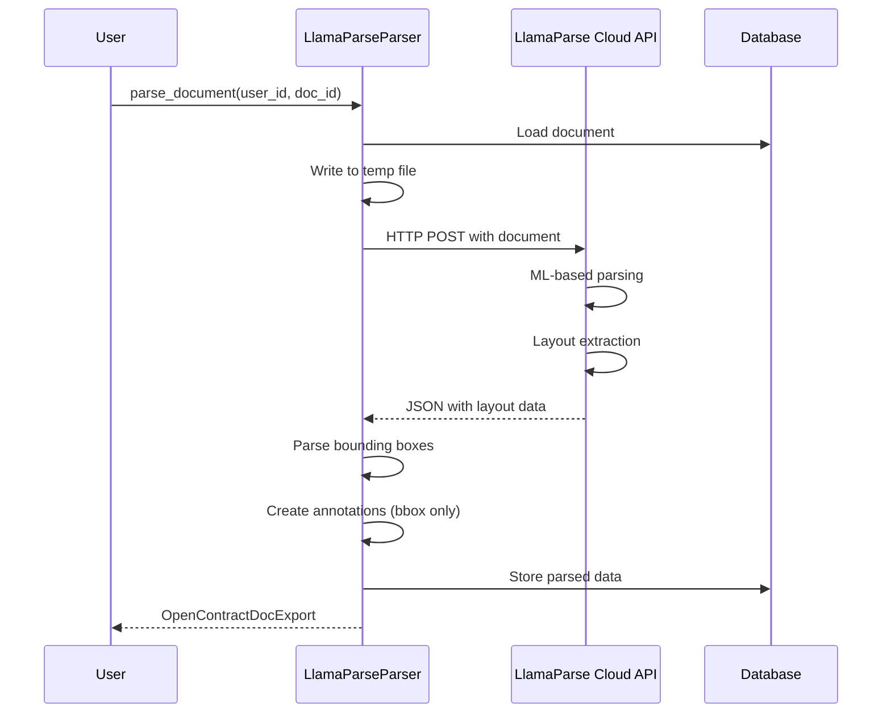

# LlamaParse Parser

## Intro

The LlamaParse Parser integrates with [LlamaParse](https://cloud.llamaindex.ai/) (from LlamaIndex) to parse PDF and DOCX documents with advanced layout extraction. It provides high-quality structural annotations with bounding boxes, making it ideal for complex document layouts.

LlamaParse is a cloud-based API service that uses advanced ML models to extract document structure, including titles, headings, paragraphs, tables, figures, and more. Unlike the Docling parser which runs as a local microservice, LlamaParse requires an API key and sends documents to LlamaIndex's cloud infrastructure.

## Architecture



## Features

- **Cloud-based API**: Uses LlamaIndex's managed parsing infrastructure
- **Layout Extraction**: Returns bounding boxes for all document elements
- **Multiple Output Formats**: Supports JSON (with layout), markdown, and plain text
- **Structural Annotations**: Automatically creates annotations for document structure
- **Multi-format Support**: Parses both PDF and DOCX files
- **Parallel Processing**: Configurable worker count for batch processing
- **Automatic OCR**: Handles scanned documents automatically

## Configuration

### Environment Variables

Configure the parser using environment variables:

```bash
# Required: API key (either variable works)
LLAMAPARSE_API_KEY=llx-your-api-key-here
# OR use LlamaIndex's default env var name:
LLAMA_CLOUD_API_KEY=llx-your-api-key-here

# Optional: Output format ("json", "markdown", "text")
# Default: "json" - required for layout extraction
LLAMAPARSE_RESULT_TYPE=json

# Optional: Enable layout extraction with bounding boxes
# Default: True
LLAMAPARSE_EXTRACT_LAYOUT=True

# Optional: Number of parallel workers for batch processing
# Default: 4
LLAMAPARSE_NUM_WORKERS=4

# Optional: Document language code
# Default: "en"
LLAMAPARSE_LANGUAGE=en

# Optional: Enable verbose logging
# Default: False
LLAMAPARSE_VERBOSE=False

# Select LlamaParse as the default PDF parser
PDF_PARSER=llamaparse
```

### Django Settings

The parser is configured in `config/settings/base.py`:

```python
# LlamaParse Settings
LLAMAPARSE_API_KEY = env.str("LLAMAPARSE_API_KEY", default="")
LLAMAPARSE_RESULT_TYPE = env.str("LLAMAPARSE_RESULT_TYPE", default="json")
LLAMAPARSE_EXTRACT_LAYOUT = env.bool("LLAMAPARSE_EXTRACT_LAYOUT", default=True)
LLAMAPARSE_NUM_WORKERS = env.int("LLAMAPARSE_NUM_WORKERS", default=4)
LLAMAPARSE_LANGUAGE = env.str("LLAMAPARSE_LANGUAGE", default="en")
LLAMAPARSE_VERBOSE = env.bool("LLAMAPARSE_VERBOSE", default=False)

# Parser selection
PDF_PARSER = env.str("PDF_PARSER", default="docling")  # Set to "llamaparse"
```

### Parser Registration

The parser is automatically registered in `PREFERRED_PARSERS` when `PDF_PARSER=llamaparse`:

```python
PREFERRED_PARSERS = {
    "application/pdf": "opencontractserver.pipeline.parsers.llamaparse_parser.LlamaParseParser",
    # ... other mime types
}
```

## Usage

### Basic Usage

```python
from opencontractserver.pipeline.parsers.llamaparse_parser import LlamaParseParser

parser = LlamaParseParser()
result = parser.parse_document(user_id=1, doc_id=123)
```

### With Options Override

```python
# Override default settings for a specific parse
result = parser.parse_document(
    user_id=1,
    doc_id=123,
    result_type="json",
    extract_layout=True,
    language="en",
    verbose=True,
)
```

### Text-Only Mode (No Layout)

```python
# For faster parsing without bounding boxes
result = parser.parse_document(
    user_id=1,
    doc_id=123,
    result_type="markdown",  # or "text"
    extract_layout=False,
)
```

## Output

The parser returns an `OpenContractDocExport` dictionary containing:

```python
{
    "title": str,                    # Document title
    "description": str,              # Document description
    "content": str,                  # Full text content
    "page_count": int,               # Number of pages
    "pawls_file_content": List[dict],  # PAWLS token data per page
    "labelled_text": List[dict],     # Structural annotations
    "relationships": List[dict],     # (Empty - no relationships extracted)
    "doc_labels": List[dict],        # (Empty - no doc labels extracted)
}
```

## Element Type Mapping

LlamaParse elements are mapped to OpenContracts annotation labels:

| LlamaParse Type | OpenContracts Label |
|-----------------|---------------------|
| `title` | Title |
| `section_header` | Section Header |
| `heading` | Heading |
| `text` | Text Block |
| `paragraph` | Paragraph |
| `table` | Table |
| `figure` | Figure |
| `image` | Image |
| `list` | List |
| `list_item` | List Item |
| `caption` | Caption |
| `footnote` | Footnote |
| `header` | Page Header |
| `footer` | Page Footer |
| `page_number` | Page Number |
| `equation` | Equation |
| `code` | Code Block |

## Processing Steps

1. **Document Loading**
   - Loads document from Django storage
   - Writes to temporary file (LlamaParse requires file path)

2. **API Call**
   - Sends document to LlamaParse cloud API
   - Uses `get_json_result()` for layout mode
   - Uses `load_data()` for text/markdown mode

3. **Bounding Box Conversion**
   - LlamaParse returns coordinates in various formats (fractional 0-1 or absolute)
   - Converts to absolute page coordinates
   - Handles multiple bbox formats (`x/y/w/h`, `left/top/right/bottom`, `x1/y1/x2/y2`, arrays)
   - Applies sanity checks and bounds clamping

4. **Annotation Creation**
   - Maps element types to OpenContracts labels
   - Creates structural annotations with bounding boxes
   - Annotations use empty `tokensJsons` (see [Limitations](#limitations))

5. **Cleanup**
   - Removes temporary file
   - Returns OpenContractDocExport

## Comparison with Other Parsers

| Feature | LlamaParse | Docling |
|---------|------------|---------|
| Deployment | Cloud API | Local microservice |
| API Key Required | Yes | No |
| Layout Extraction | Yes | Yes |
| Relationship Detection | No | Yes (groups) |
| OCR Support | Yes (automatic) | Yes (Tesseract) |
| DOCX Support | Yes | Yes |
| Cost | Per-page pricing | Free |
| Privacy | Cloud processing | Local processing |

## Error Handling

The parser handles errors gracefully:

- **Missing API Key**: Returns None with error log
- **Document Not Found**: Returns None with error log
- **API Errors**: Returns None with detailed error message
- **Import Errors**: Returns None if `llama-parse` not installed
- **Empty Results**: Returns None with warning

Example error handling:

```python
result = parser.parse_document(user_id=1, doc_id=123)
if result is None:
    # Check logs for error details
    logger.error("Parsing failed")
```

## Troubleshooting

### Common Issues

1. **API Key Not Configured**
   ```
   LlamaParse API key not configured. Set LLAMAPARSE_API_KEY or LLAMA_CLOUD_API_KEY environment variable.
   ```
   - Set `LLAMAPARSE_API_KEY` in your environment
   - Verify the key is valid at [cloud.llamaindex.ai](https://cloud.llamaindex.ai/)

2. **Library Not Installed**
   ```
   llama-parse library not installed. Install with: pip install llama-parse
   ```
   - Install the library: `pip install llama-parse`
   - Or add to requirements: `llama-parse>=0.4.0`

3. **Empty Results**
   ```
   LlamaParse returned empty results
   ```
   - Verify document is readable (not corrupted)
   - Check if document has extractable text
   - Try with `verbose=True` for more details

4. **No Bounding Boxes**
   - Ensure `result_type="json"` (not "markdown" or "text")
   - Ensure `extract_layout=True`
   - Some document types may not support layout extraction

5. **Rate Limiting**
   - LlamaParse has API rate limits
   - Reduce `num_workers` for batch processing
   - Implement retry logic for production use

### Debug Mode

Enable verbose logging for troubleshooting:

```bash
LLAMAPARSE_VERBOSE=True
```

Or in code:

```python
result = parser.parse_document(user_id=1, doc_id=123, verbose=True)
```

## Performance Considerations

- **Network Latency**: Cloud API adds network round-trip time
- **Per-page Pricing**: LlamaParse charges per page processed
- **Parallel Workers**: Increase `LLAMAPARSE_NUM_WORKERS` for batch jobs
- **Result Type**: "markdown" and "text" modes are faster but lack layout
- **File Size**: Large documents may take longer to upload and process

## Security Considerations

- **API Key Security**: Store API key in environment variables, not code
- **Data Privacy**: Documents are sent to LlamaIndex cloud for processing
- **Temporary Files**: Parser cleans up temp files after processing
- **Logging**: API key is redacted from log output

## Dependencies

- `llama-parse>=0.4.0`: LlamaParse Python client
- `llama-index-core`: Core LlamaIndex library (installed with llama-parse)

Add to requirements:

```
llama-parse>=0.4.0
```

## Limitations

LlamaParse has several limitations compared to other parsers like Docling:

### No Token-Level Data

LlamaParse only provides **element-level bounding boxes**, not token-level (word-level) positions. This means:

- Annotations display as bounding box outlines only, without individual word highlighting
- The `tokensJsons` field in annotations is empty
- Text selection and word-level interactions are not available for LlamaParse-generated annotations
- The frontend handles this gracefully by showing just the bounding box boundary

**Workaround**: If you need token-level precision, use the Docling parser instead, which provides full PAWLS token data.

### No Parent-Child Relationships

LlamaParse returns **flat layout blocks** without hierarchical structure:

- No parent/child relationships between elements (e.g., list items under a list)
- No nesting information for sections/subsections
- The `relationships` field in the export is always empty
- Document structure must be inferred from element types and spatial positioning

**Workaround**: Use the Docling parser for relationship detection, which can group related elements.

### Cloud Processing Required

- Documents are sent to LlamaIndex's cloud infrastructure for processing
- Requires internet connectivity
- Subject to LlamaIndex's data handling policies
- Not suitable for highly sensitive documents that cannot leave your network

**Workaround**: Use Docling for fully local processing.

### Per-Page Pricing

- LlamaParse charges per page processed (with layout extraction: 1 extra credit per page)
- Costs can add up for large document volumes
- Free tier has limited credits

### Bounding Box Precision

- Bounding boxes may be slightly larger or smaller than the actual content
- Complex layouts (multi-column, overlapping elements) may have less accurate boxes
- Tables and figures are detected as single blocks without internal structure

### No Streaming Support

- Entire document must be uploaded and processed before results are returned
- Large documents may have significant processing time
- No progress indicators during parsing

## See Also

- [Pipeline Overview](pipeline_overview.md)
- [Docling Parser](docling_parser.md) - Local ML-based alternative with token-level data and relationships
- [LlamaParse Documentation](https://developers.llamaindex.ai/python/cloud/llamaparse/)
- [LlamaIndex Cloud](https://cloud.llamaindex.ai/)
