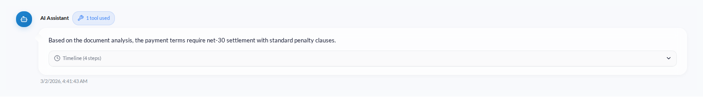
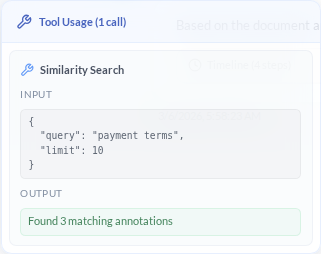
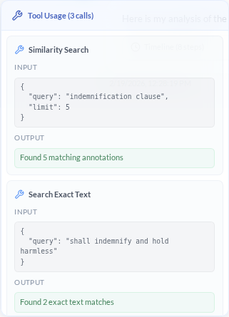

# Querying a Corpus

Once you've created a corpus of documents, you can use the **Corpus Chat** feature to ask natural language questions
and get AI-powered answers, complete with citations and links back to the relevant text in the document(s).

The chat interface maintains conversation history, allowing you to ask follow-up questions and explore your documents
interactively.

## Understanding Tool Usage

When the AI agent answers your questions, it uses various tools behind the scenes — searching for similar text,
performing exact text lookups, or querying specific documents. You can see exactly what the agent did by looking
at the **tool usage badge** that appears next to the assistant's name.

Hover over (or click) the badge to open a popover showing each tool call with its input arguments and output:

For complex queries, the agent may chain multiple tools together. The popover lists all calls in execution order:

### Available Agent Tools

| Tool | What It Does |
|------|-------------|
| **Similarity Search** | Finds annotations semantically similar to your query using vector embeddings |
| **Search Exact Text** | Locates exact string matches across document text |
| **Ask Document** | Sends a focused question to a specific document's agent |
| **Load Document Text** | Retrieves the full extracted text of a document |
| **Update Document Summary** | Writes or updates a document's summary |
| **Add Annotations** | Creates new annotations from exact text matches |
