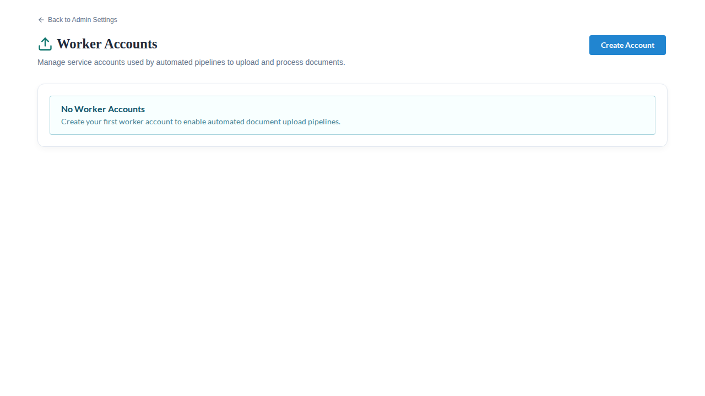
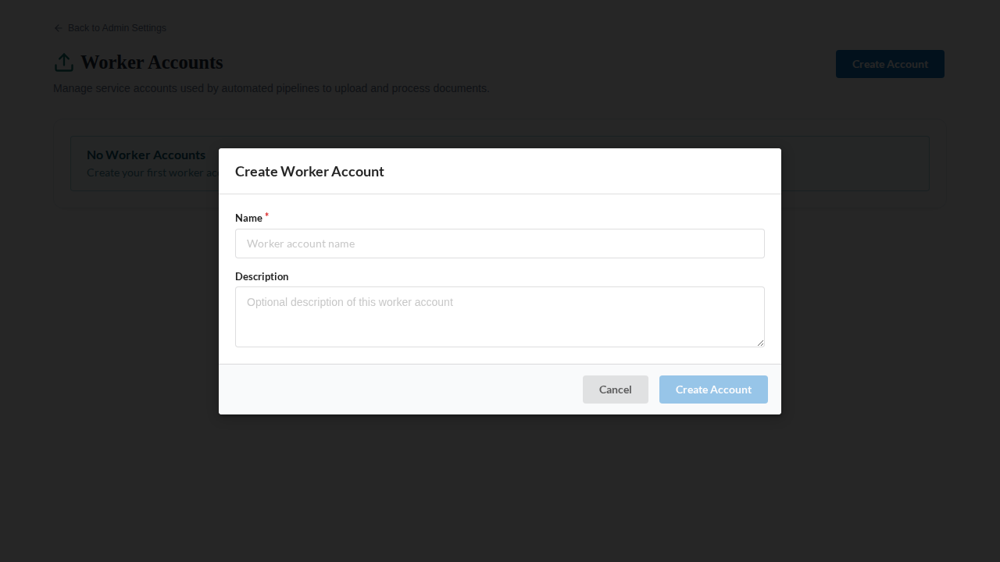
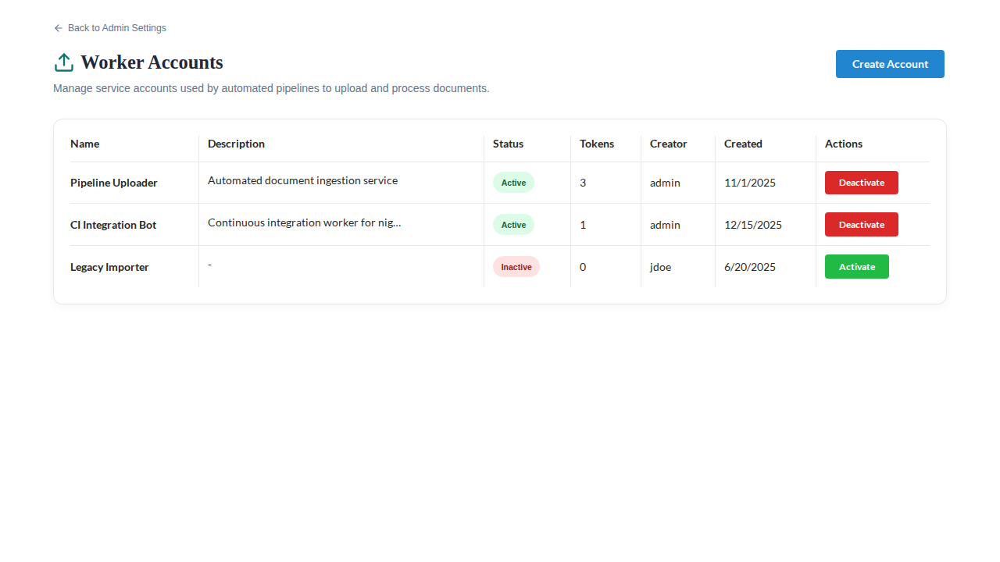
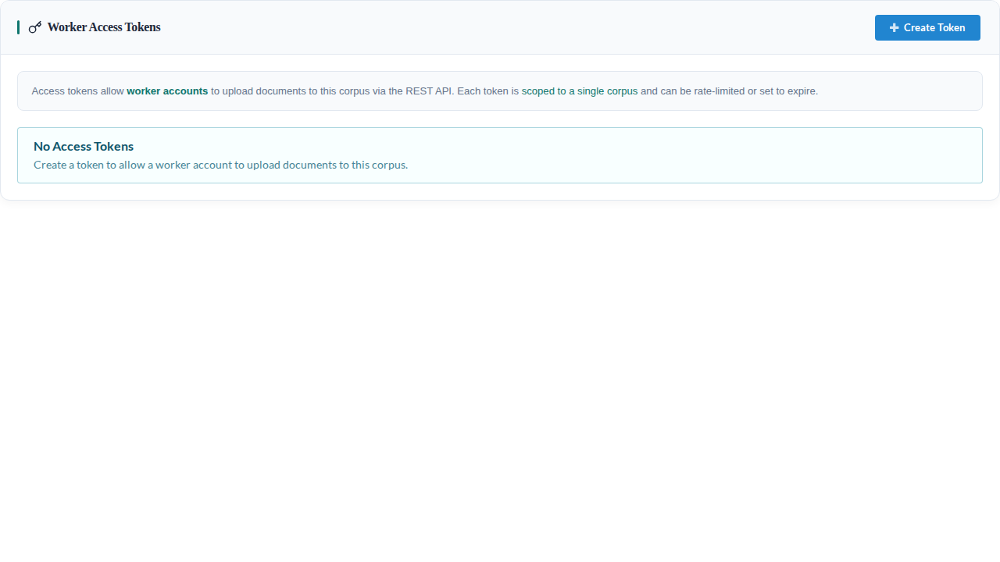
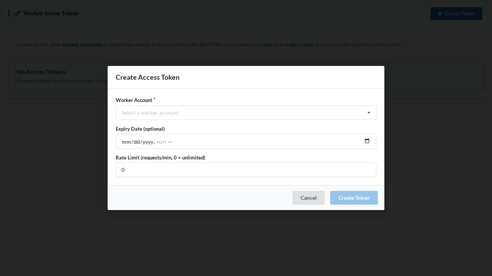
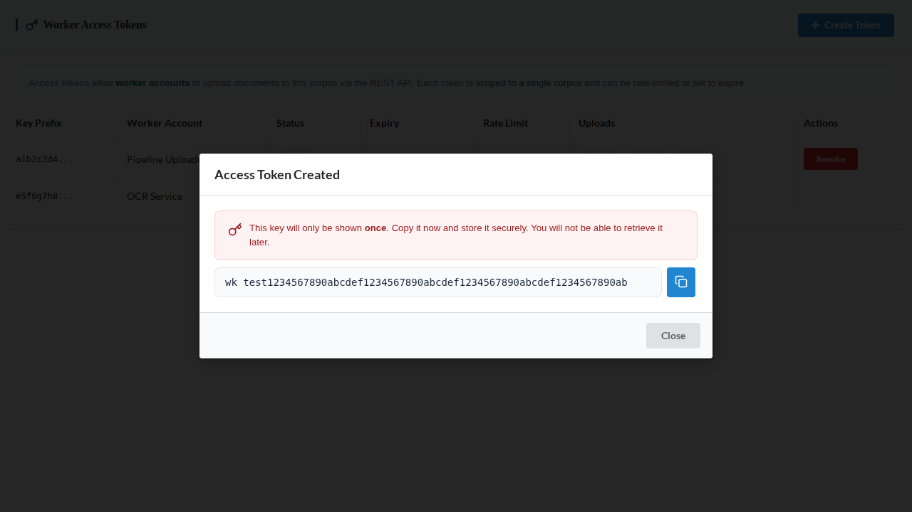
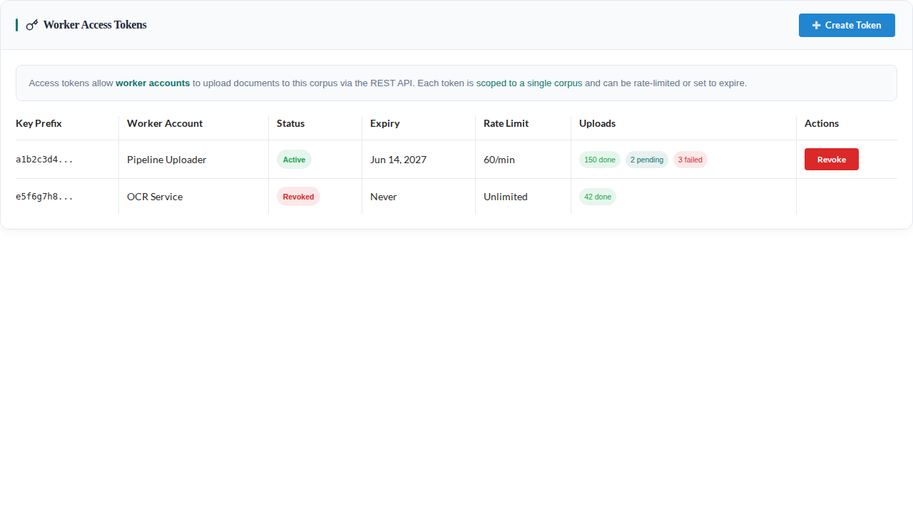

# Worker Upload System Walkthrough

## Overview

The worker upload system provides a REST API for external pipelines, bulk ingestion scripts, and pre-processed document feeds to push documents, annotations, and embeddings into OpenContracts. It is designed for machine-to-machine workflows where documents have already been parsed and annotated outside of OpenContracts' built-in pipeline.

### When to Use Worker Uploads

- **External processing pipelines** -- your organization has a custom NLP pipeline that produces structured document data.
- **Bulk ingestion** -- migrating thousands of pre-annotated documents from another system.
- **Pre-processed documents** -- documents where text extraction, layout analysis, and embedding generation have already been performed.

### Architecture

```
Worker / Script
      |
      | POST /api/worker-uploads/documents/
      | Authorization: WorkerKey <token>
      v
  REST API (DRF)
      |
      | Validates token, enforces rate limit,
      | writes file + metadata to staging table
      v
  WorkerDocumentUpload (staging table)
      |
      | Celery beat schedule + on-upload trigger
      v
  Batch Processor (Celery task)
      |
      | SELECT ... FOR UPDATE SKIP LOCKED
      | Processes each upload in its own transaction
      v
  Document + Annotations + Embeddings
      (in target Corpus)
```

The staging table acts as a database-backed queue, avoiding Redis saturation when handling large volumes of uploads. The batch processor uses `SELECT ... FOR UPDATE SKIP LOCKED` so multiple Celery workers can drain the queue concurrently without conflicts.

---

## Prerequisites

- A running OpenContracts instance with the Celery worker processing the `worker_uploads` queue.
- A **superuser account** for creating worker accounts and corpus access tokens via the admin UI or GraphQL mutations.
- A **corpus** that will receive the uploaded documents.

---

## Step 1: Create a Worker Account

Worker accounts are service accounts with no web login capability. They exist solely to authenticate external pipelines via scoped tokens.

### Via the Admin UI

1. Navigate to **Admin Settings > Worker Accounts**. If this is your first time, you will see an empty state prompting you to create an account:



2. Click **Create Account**. A modal appears with fields for name and description:



3. Enter a descriptive **name** (e.g., `docling-pipeline-prod`) and optional **description**.
4. Click **Create Account** to save. A Django user with an unusable password is auto-created behind the scenes. The new account appears in the list:



From this list you can **deactivate** accounts (which implicitly invalidates all their tokens) or **reactivate** previously deactivated ones.

### Via GraphQL

```graphql
mutation {
  createWorkerAccount(name: "docling-pipeline-prod", description: "Production Docling parser") {
    ok
    workerAccount {
      id
      name
      isActive
    }
  }
}
```

Only superusers can create worker accounts.

---

## Step 2: Create a Corpus Access Token

Each token is scoped to exactly one corpus. To upload to multiple corpuses, create one token per corpus.

### Via the Corpus Settings UI

1. Open the target corpus and navigate to **Corpus Settings**. Scroll to the **Worker Access Tokens** section. If no tokens have been created yet, you will see an empty state:



2. Click **Create Token**. A modal appears where you select the worker account, and optionally set an **expiry date** and a **rate limit** (uploads per minute; 0 = unlimited):



3. Click **Create Token**. A one-time key display appears immediately:



**IMPORTANT**: Copy and store the token key immediately. It is displayed only once. The server stores only a SHA-256 hash; the plaintext cannot be recovered.

4. After dismissing the key display, the token appears in the list along with its status, expiry, rate limit, and upload statistics:



From this list you can **revoke** active tokens. Revoked tokens can no longer authenticate, but their upload history is preserved.

### Via GraphQL

```graphql
mutation {
  createCorpusAccessToken(
    workerAccountId: 1
    corpusId: 1
    rateLimitPerMinute: 60
  ) {
    ok
    token {
      id
      key
      workerAccountName
      expiresAt
      rateLimitPerMinute
    }
  }
}
```

Store the `token.key` value securely. It will not be returned again.

---

## Step 3: Upload a Document

### Endpoint

```
POST /api/worker-uploads/documents/
Content-Type: multipart/form-data
Authorization: WorkerKey <your-token>
```

The request body is multipart form data with two fields:

| Field | Type | Description |
|-------|------|-------------|
| `file` | File | The document file (PDF or other supported format) |
| `metadata` | String | JSON string containing document metadata, text, annotations, and embeddings |

### curl Example

```bash
curl -X POST https://your-instance.com/api/worker-uploads/documents/ \
  -H "Authorization: WorkerKey YOUR_TOKEN_HERE" \
  -F "file=@document.pdf" \
  -F 'metadata={
    "title": "Contract Agreement",
    "content": "Full extracted text of the document...",
    "page_count": 5,
    "pawls_file_content": [
      {
        "page": {"width": 612, "height": 792, "index": 0},
        "tokens": [
          {"x": 72, "y": 72, "width": 50, "height": 12, "text": "Contract"}
        ]
      }
    ]
  }'
```

### Python Example

```python
import json
import requests

url = "https://your-instance.com/api/worker-uploads/documents/"
headers = {"Authorization": "WorkerKey YOUR_TOKEN_HERE"}

metadata = {
    "title": "Contract Agreement",
    "content": "Full extracted text of the document...",
    "page_count": 5,
    "pawls_file_content": [
        {
            "page": {"width": 612, "height": 792, "index": 0},
            "tokens": [
                {"x": 72, "y": 72, "width": 50, "height": 12, "text": "Contract"}
            ],
        }
    ],
}

with open("document.pdf", "rb") as f:
    response = requests.post(
        url,
        headers=headers,
        files={"file": ("document.pdf", f, "application/pdf")},
        data={"metadata": json.dumps(metadata)},
    )

print(response.status_code)  # 202 Accepted
print(response.json())
```

A successful upload returns HTTP 202 (Accepted) with a JSON body containing the `upload_id` and initial `status` of `PENDING`.

---

## Step 4: Monitor Upload Status

### Check a Single Upload

```
GET /api/worker-uploads/documents/<upload-id>/
Authorization: WorkerKey <your-token>
```

Returns the current status, timestamps, and (once completed) the `document_id` of the created document.

### List All Uploads for This Token

```
GET /api/worker-uploads/documents/list/
Authorization: WorkerKey <your-token>
```

Returns a paginated list of all uploads made with this token. Supports the following query parameters:

| Parameter | Description |
|-----------|-------------|
| `status` | Filter by status: `PENDING`, `PROCESSING`, `COMPLETED`, or `FAILED` |
| `page` | Page number (default: 1) |
| `page_size` | Results per page (default: 50, max: 200) |

Example -- list only completed uploads:

```
GET /api/worker-uploads/documents/list/?status=COMPLETED
```

### Upload Lifecycle

```
PENDING  -->  PROCESSING  -->  COMPLETED
                    |
                    +-------->  FAILED
```

- **PENDING** -- the upload is staged and waiting for the batch processor.
- **PROCESSING** -- the batch processor has claimed this upload and is creating the document, annotations, and embeddings.
- **COMPLETED** -- the document was successfully created and added to the corpus.
- **FAILED** -- processing encountered an error. Check the `error_message` field for details.

The batch processor runs on two triggers:

1. **On upload** -- each new upload nudges the Celery task to process pending items immediately.
2. **Periodic schedule** -- Celery Beat triggers the processor at regular intervals to catch any uploads that arrived during worker downtime.

Uploads stuck in `PROCESSING` for longer than `WORKER_UPLOAD_STALE_MINUTES` (default: 15 minutes) are automatically reset to `PENDING` by a recovery task.

---

## Metadata Format Reference

The `metadata` field is a JSON string with the following schema:

### Required Fields

| Field | Type | Description |
|-------|------|-------------|
| `title` | string | Document title. Used as the display name in the UI. |
| `content` | string | Full extracted text of the document. Stored as the `.txt` extract file. |
| `page_count` | integer | Number of pages in the document. |
| `pawls_file_content` | array | PAWLs token data. One object per page containing `page` dimensions and `tokens` array. |

### Optional Fields

| Field | Type | Description |
|-------|------|-------------|
| `description` | string | Document description displayed in the UI. |
| `file_type` | string | MIME type of the uploaded file. Defaults to `application/pdf`. |
| `target_path` | string | Desired file path within the corpus (e.g., `"contracts/nda.pdf"`). |
| `target_folder_path` | string | Folder path to place the document in (e.g., `"contracts/2024"`). Folders are created automatically if they do not exist. |
| `doc_labels` | array of strings | Label names to apply at the document level. Labels must be defined in `doc_labels_definitions`. |
| `doc_labels_definitions` | object | Label definitions for document-level labels. Keys are label names; values are objects with label properties. |
| `text_labels` | object | Label definitions for text annotations. Keys are label names; values are objects with label properties. |
| `labelled_text` | array | Text annotation data. Each entry specifies a text span, page, bounding box, and label. |
| `relationships` | array | Relationships between annotations. Each entry specifies source and target annotation IDs and a label. |
| `embeddings` | object | Pre-computed vector embeddings. See the Embeddings Format section below. |

### PAWLs Format

Each entry in `pawls_file_content` has this structure:

```json
{
  "page": {
    "width": 612,
    "height": 792,
    "index": 0
  },
  "tokens": [
    {
      "x": 72,
      "y": 72,
      "width": 50,
      "height": 12,
      "text": "Contract"
    }
  ]
}
```

- `page.index` is zero-based.
- Token coordinates are in PDF points (1/72 inch), origin at top-left.

### Embeddings Format

Pre-computed embeddings allow you to skip the embedding step in OpenContracts. The `embeddings` object has this structure:

```json
{
  "embeddings": {
    "embedder_path": "sentence-transformers/all-MiniLM-L6-v2",
    "document_embedding": [0.1, 0.2, "..."],
    "annotation_embeddings": {
      "annot-0": [0.3, 0.4, "..."],
      "annot-1": [0.5, 0.6, "..."]
    }
  }
}
```

| Field | Type | Required | Description |
|-------|------|----------|-------------|
| `embedder_path` | string | Yes (if embeddings provided) | Identifier for the embedding model (e.g., a HuggingFace model path). |
| `document_embedding` | array of floats | No | Embedding vector for the entire document. |
| `annotation_embeddings` | object | No | Map of annotation ID to embedding vector. Keys must match the annotation IDs used in `labelled_text`. |

**Supported vector dimensions**: 384, 768, 1024, 1536, 2048, 3072, 4096.

Vectors with unsupported dimensions are silently skipped.

---

## Rate Limiting

Rate limits are configured per token via the `rate_limit_per_minute` field.

- A value of `0` means unlimited (no rate limiting).
- When the limit is exceeded, the API returns HTTP 429 with a `Retry-After: 60` header.
- The check is best-effort (non-atomic): under concurrent burst traffic, a caller may marginally exceed the limit. For strict enforcement, use a reverse proxy such as nginx `limit_req`.

---

## Error Handling

### HTTP Response Codes

| Status | Meaning |
|--------|---------|
| 202 | **Accepted** -- upload queued for processing. |
| 400 | **Bad Request** -- invalid metadata format or missing required fields. |
| 401 | **Unauthorized** -- missing or invalid `WorkerKey` token. |
| 403 | **Forbidden** -- token revoked or worker account deactivated. |
| 413 | **Payload Too Large** -- file exceeds `MAX_WORKER_UPLOAD_SIZE_BYTES` (default: 256 MB) or metadata exceeds `MAX_WORKER_METADATA_SIZE_BYTES` (default: 500 MB). |
| 429 | **Too Many Requests** -- rate limit exceeded. Retry after 60 seconds. |

### Processing Errors

If document processing fails after the upload is accepted, the upload record transitions to `FAILED` status. Query the upload status endpoint to retrieve the `error_message` field with details about what went wrong.

Common processing failure causes:

- The corpus creator's account has been deactivated.
- The corpus has been deleted between upload and processing.
- Invalid PAWLs data that cannot be parsed into document structure.
- Embedding vectors with unsupported dimensions.

---

## Security Model

### Token Storage

Token keys are SHA-256 hashed before storage. The plaintext is returned exactly once at creation and never persisted. Authentication works by hashing the incoming key and looking up the hash in the database.

### Scope

Each token is scoped to exactly one corpus. A token cannot be used to upload to any other corpus. Create separate tokens for each corpus a worker needs to access.

### Worker Accounts

Worker accounts are Django users with unusable passwords. They cannot log in via the web UI, GraphQL, or any other authentication method. They exist solely for permission compatibility with OpenContracts' guardian-based permission system.

### Ownership

Documents uploaded via workers are owned by the **corpus creator**, not the worker's service account. This ensures the documents inherit the correct permissions and appear naturally in the corpus owner's workspace.

### Deactivation

- **Revoking a token** (`is_active=False`) immediately prevents that token from authenticating. Existing uploads already in the queue continue processing.
- **Deactivating a worker account** (`is_active=False`) implicitly invalidates all of its tokens. Any authentication attempt with any of the account's tokens will be rejected.

---

## Configuration Reference

These settings can be configured via environment variables or in your Django settings:

| Setting | Default | Description |
|---------|---------|-------------|
| `MAX_WORKER_UPLOAD_SIZE_BYTES` | 268435456 (256 MB) | Maximum file size accepted by the upload endpoint. Set to 0 to disable. |
| `MAX_WORKER_METADATA_SIZE_BYTES` | 524288000 (500 MB) | Maximum metadata JSON size. Set to 0 to disable. |
| `WORKER_UPLOAD_BATCH_SIZE` | 50 | Number of uploads claimed per batch processor run. |
| `WORKER_UPLOAD_STALE_MINUTES` | 15 | Minutes before a `PROCESSING` upload is considered stalled and reset to `PENDING`. |
